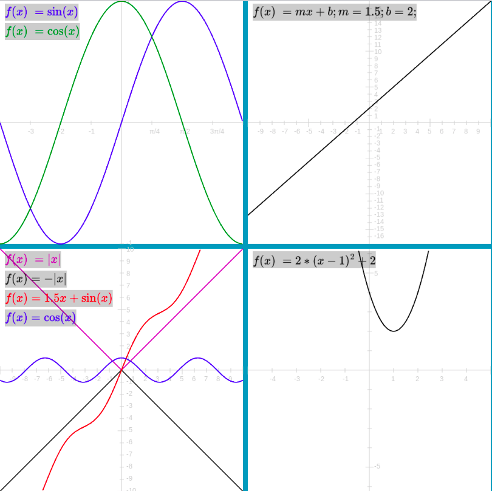

## Intro
This is a simple project to make cartesian graphs from math functions and to format the functions along with their plot in an HTML5 canvas.  The project uses PixiJS for the canvas rendering functions and asset loading.

This is a combo frontend and small supporting TS-Node/Express based backend service for processing TeX strings into SVGs (the rendered TeX output).

Separating the SVG rendering to the backend was necessary to allow PixiJS's Assets management/loader class to load/parse the SVG, attempts at using the mathjax libs client side and rendering the SVG with Pixi's Graphics object directly didn't seem to account for the SVG containers scale.  This seems to be due to Pixi rendering of the SVG into a "native Graphics" object in Pixi's context not accounting for the scaling of the path's parent element's effect on the path.

### Example Output

### Install
`npm install`

### Run
`npm start`

### Edit

See the [src/AppPixi.ts](src/AppPixi.ts) for the example use of the CartesianGraph class and to modify the functions being drawn.

#### Reference
Quick-reference for TeX syntax here:
https://www.math.brown.edu/johsilve/ReferenceCards/TeXRefCard.v1.5.pdf

Deeper reference on CTAN
https://mirrors.rit.edu/CTAN/info/impatient/book.pdf
https://ctan.org/pkg/impatient